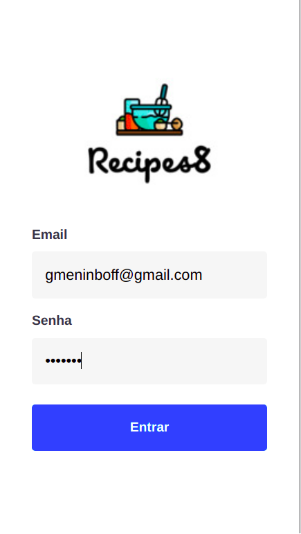
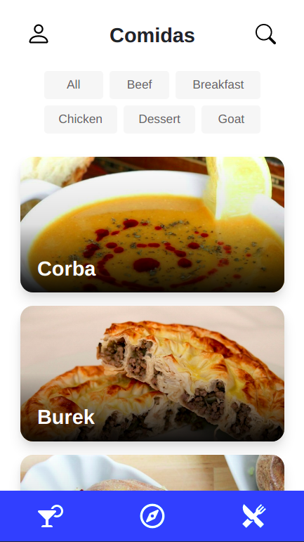
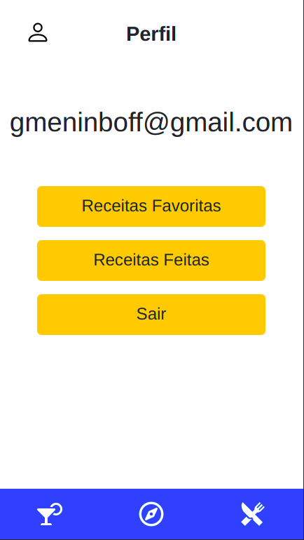
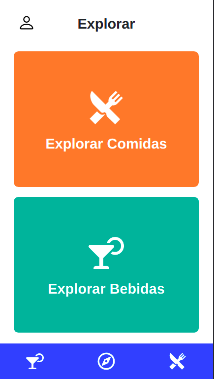

<header>
  <h1>PROJETO RECIPES APP</h1>  
    
Desenvolvido em ReactJS e ContextAPI + Hooks, o Recipes App foi feito em grupo para aprimorarmos nossos conhecimentos dentro do módulo de Front-End do curso de Desenvolvimento Web da Trybe.

     
     
    <a href="https://github.com/tryber/sd-011-project-recipes-app/tree/main-group-8">BRANCH ORIGINAL</a>
</header>

##

<main>
  <h2>O QUE FOI DESENVOLVIDO</h2>
  
O Recipes App foi feito utilizando o que há de mais moderno dentro do ecossistema React: Hooks e Context API!

  
Nele é possível ver, buscar, filtrar, favoritar e acompanhar o processo de preparação de receitas e drinks!

  
A base de dados são 2 APIs distintas, uma para comidas e outra para bebidas.

  
  
O layout tem como foco dispositivos móveis, então todos os protótipos foram desenvolvidos em telas menores.

</main>

<section>
  <h3>APIs UTILIZADAS</h3>
    <ul>
      <li><a href="https://www.themealdb.com/">TheMealDB API</a></li>
      <li><a href="https://www.thecocktaildb.com/api.php">TheCockTailDB API</a></li>
    </ul>
</section>

<section>
  <h3>COMO RODAR O RECIPES APP</h3>
  <ol>
    <li>Clone o repositório.</li>
    <li>Na raiz do projeto utilize o comando <b>npm install</b>.</li>
    <li>Agora utilize o comando <b>npm start</b>.</li>
     
    <li>É necessário por um email qualquer e uma senha de no mínimo 6 dígitos.</li>
  </ol>
</section>

##

<section>
  <h3>PESSOAS DESENVOLVEDORAS:</h2>
    <ul>
      <li>
      <a href="https://github.com/gab-boff">Gabriel Boff</a>
      </li>
      <li>
      <a href="https://github.com/vitorguima">Vitor Guimarães</a>
      </li>
      <li>
      <a href="https://github.com/msgaspar">Matheus Gaspar</a>
      </li>
      <li>
      <a href="https://github.com/tomsantos07">Tom Santos</a>
      </li>
    </ul>
</section>

<section>
  <h2>CONSIDERAÇÃO FINAL</h2>
  
Este projeto foi criado apenas por razões didáticas, sem nenhum objetivo além desse.

</section>
